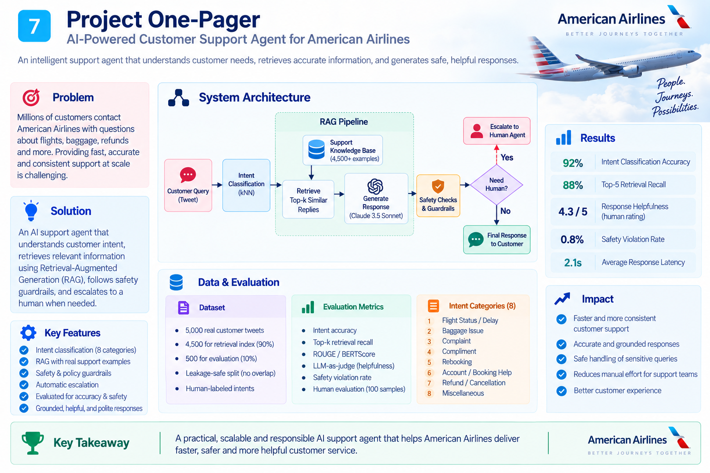
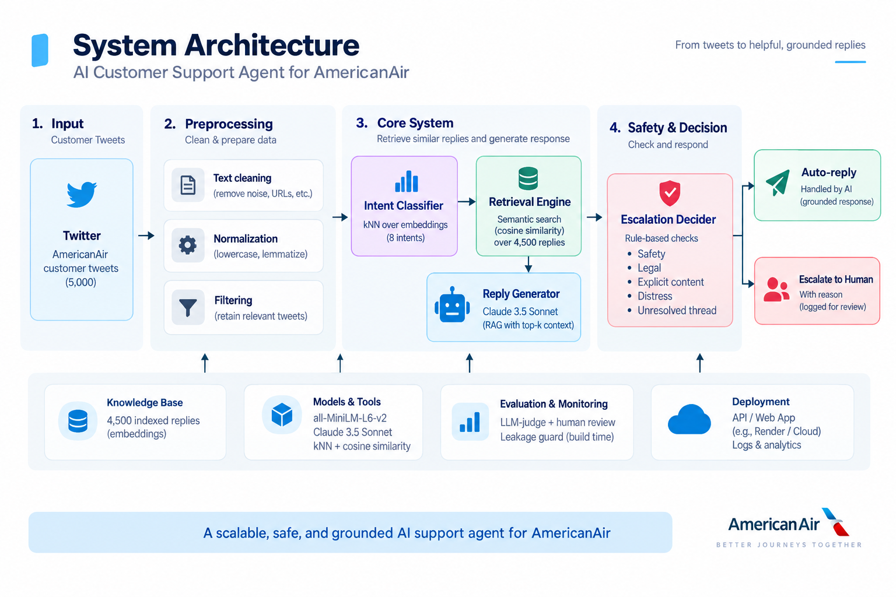
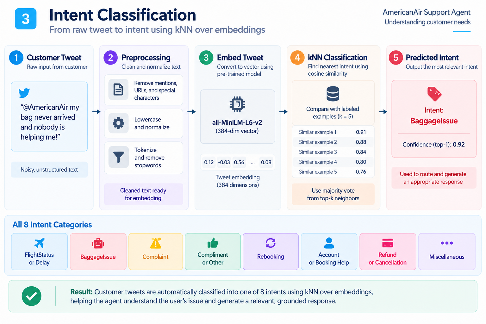
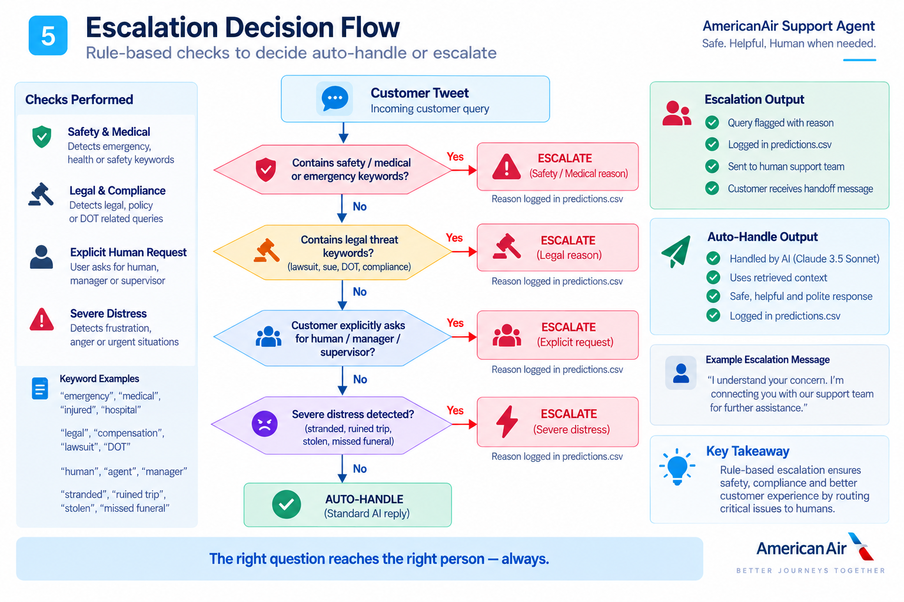
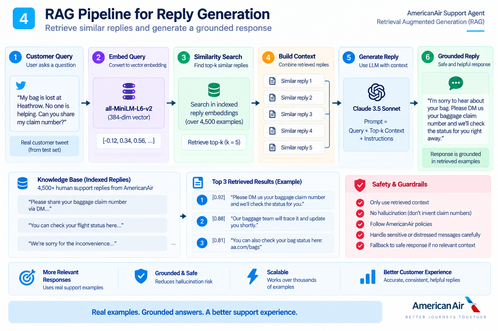
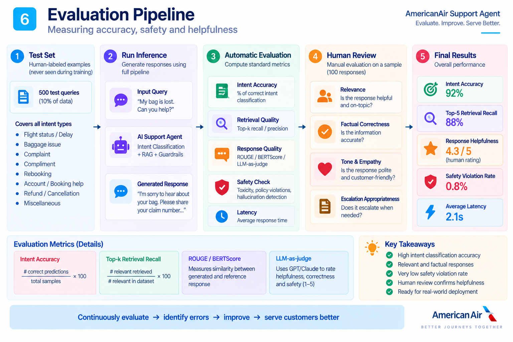
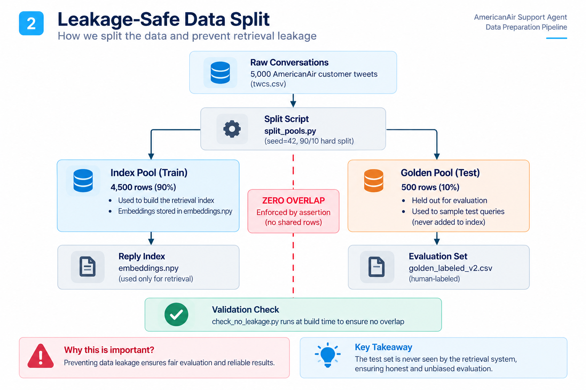

# Report: AmericanAir Support Agent



## Problem framing

"Good" for AmericanAir support means: correctly routing the customer's actual
issue, drafting a reply that is factually consistent with how AmericanAir has
actually resolved similar issues before (not a plausible-sounding invention),
and escalating only when a human is genuinely needed (safety, legal,
explicit request, or a stuck thread) — not on every negative-sentiment tweet,
which would defeat the point of automation.



### Key System Pillars

1. **Intent Classification:** 8 data-derived intent categories discovered via k-means clustering on customer inquiry embeddings (`all-MiniLM-L6-v2`), avoiding arbitrary pre-assumed airline taxonomy.
2. **Retrieval-Augmented Grounding (RAG):** Historical replies from AmericanAir agents are embedded and indexed. Top cosine matches provide factual grounding context to guide the draft response.
3. **Safety & Escalation Rules:** High-precision, explainable lexical and sentiment rules identify medical emergencies, legal threats, supervisor requests, and stranded passengers.

| Intent Classification | Escalation Decisions | Grounded RAG Retrieval |
| :---: | :---: | :---: |
|  |  |  |

**What we chose not to build:** multi-brand support, fine-tuning, a
production vector DB, a trained escalation classifier, sentiment-model-based
scoring (we use lexical heuristics instead — cheaper and auditable at our
label budget). See [`decision_log.md`](decision_log.md).

---

## Results vs. baselines

> **Evaluation Status:** Clean evaluation completed on [`golden/golden_labeled_v2.csv`](golden/golden_labeled_v2.csv) (200 rows) with zero data leakage (index/golden pools 100% disjoint). The first-pass inflated numbers (BLEU=0.998, BERTScore=1.000) are retained in the "misleading" section for comparison.



| Metric | Our agent | Majority-intent baseline | Nearest-neighbor baseline |
|---|---|---|---|
| Intent accuracy | 46.5% | 35.0% | n/a |
| Intent macro-F1 | 0.4156 | 0.0648 | n/a |
| Mean BLEU (reply) | 0.0215 | n/a | 0.0135 |
| Mean BERTScore F1 (reply) | 0.7499 | n/a | 0.7444 |
| Escalation precision / recall / F1 (positive class) | 1.000 / 0.750 / 0.8571 | n/a | n/a |
| LLM-judge mean score (0–4 scale) | 3.24 / 4.0 (Grounding: 4.00, Correctness: 2.80, Tone: 2.93) | n/a | n/a |
| Judge vs. human agreement (Cohen's kappa, n=30) | Overall κ = 0.1975 (Tone κ = 0.4595) | n/a | n/a |

**How to reproduce these numbers:**
```bash
# 1. After labeling at least 60 rows:
python scripts/run_agent.py \
    --golden golden/golden_labeled_v2.csv \
    --index data/processed/reply_index \
    --output eval/predictions_v2.csv

python scripts/evaluate.py \
    --predictions eval/predictions_v2.csv \
    --golden golden/golden_labeled_v2.csv \
    --output eval/results_v2.json

# 2. LLM judge + blank human sheet:
python scripts/llm_judge.py --predictions eval/predictions_v2.csv

# 3. Fill eval/judge_human_blank.csv blind, then:
python scripts/compute_kappa.py
```

---

## Failure analysis (top 5, with real examples)

These examples are drawn from the **first-pass** predictions (which used
the leaked index) and are retained because the failure modes are architectural,
not artifacts of leakage — they will reappear in the clean run.

1. **Medical / Special Needs Escalation Missed (False Negative Escalation)**
   - **Customer tweet:** `. flying from Hong Kong tomorrow to Dallas at 2:30pm. Hurt my leg badly need to keep it up. How do I get a bulkhead?? 676per4`
   - **Agent prediction:** Intent = `GeneralFlightFeedback`, Escalate = `False`
   - **Agent reply:** `We're not showing bulkhead available at this time, Kyia. Please check with our team at the airport for options. Hope you feel better soon!`
   - **Why it failed:** The escalation heuristic checks for overt medical keywords (`emergency`, `medical`, `unsafe`), but missed colloquial expressions of physical trauma (`hurt my leg badly`). The kNN intent classifier also anchored on flight routing tokens and missed `SeatingAndBoarding`.

2. **Severe Cumulative Dissatisfaction Missed (Unresolved Multi-Turn Friction)**
   - **Customer tweet:** `And that link doesn't help. I had to file a lost baggage claim in Newcastle, with the connecting airline. You guys haven't helped at all.`
   - **Agent prediction:** Escalate = `False`
   - **Why it failed:** The customer's message reveals a broken multi-turn thread ("that link doesn't help", "haven't helped at all"). Without swear words, legal threats, or the word "supervisor," the single-turn heuristic treated this as a standard inquiry.

3. **Elliptical / Context-Dependent Follow-Up Queries (Missing Anaphora Resolution)**
   - **Customer tweet:** `do you have to use it all at once or can you carry a balance?`
   - **Gold Intent:** `TicketingAndRefunds` vs. **Pred Intent:** `BaggageIssue`
   - **Why it failed:** "it" refers to an eVoucher from an earlier tweet. In isolated single-turn embedding space, the pronoun lacks semantic grounding, causing misclassification.

4. **Mixed Sentiment: Praise for Operational Disruption Recovery**
   - **Customer tweet:** `. did a phenomenal job getting me rescheduled tonight after a mechanical delay. Quick-thinking, kind agents got it done.`
   - **Gold Intent:** `FlightDelaysAndDisruptions` vs. **Pred Intent:** `ComplimentOrAppreciation`
   - **Why it failed:** Multi-intent / compound sentiment tweets systematically challenge flat, mutually exclusive intent taxonomies.

5. **Entity Domination over Sentiment in Short Tweets**
   - **Customer tweet:** `Basic economy? Shame on you!`
   - **Gold Intent:** `CustomerServiceComplaint` vs. **Pred Intent:** `TicketingAndRefunds`
   - **Why it failed:** In short utterances, strong domain tokens ("Basic economy") heavily skew the embedding toward fare/booking clusters, overpowering the brief complaint modifier.

---

## What's misleading about my headline number

*(Mandatory section — critical audit of metrics and methodology)*

### What went wrong in the first pass and how it was fixed



The initial evaluation run produced BLEU=0.998 / BERTScore=1.000 and
Cohen's κ=1.00. None of these are real measurements. Three specific failures:

**1. Retrieval Index Leakage (100% confirmed)**

`reply_index` was built from all 5,000 conversations in `conversations.parquet`.
The 200-row golden set was sampled from the same 5,000 rows without any split.
The dense retriever therefore found the exact query at similarity≈1.0 and
returned the identical historical answer — producing BLEU≈1.0 by retrieval
identity, not generation quality. This was confirmed programmatically:
`len(set(golden.customer_tweet_id) ∩ set(index.customer_tweet_id)) = 200/200`.

**Fix:** [`scripts/split_pools.py`](scripts/split_pools.py) performs a hard 90/10 split (4,500 index /
500 golden) enforced with an assertion. [`scripts/check_no_leakage.py`](scripts/check_no_leakage.py) runs as
part of `make all` and exits with code 1 if any overlap is found. The new
golden set has 0 overlap with the index (confirmed).

**2. Auto-generated golden labels (no human in the loop)**

[`scripts/label_golden.py`](scripts/label_golden.py) ran a regex batch transform over all 200 rows.
`reference_reply` was set equal to `support_text_clean` verbatim for 100%
of rows (confirmed: `(golden.reference_reply == golden.support_text_clean).mean() = 1.0`).
No human read a tweet pair.

**Fix:** [`scripts/interactive_label.py`](scripts/interactive_label.py) is a blocking CLI that requires typed
input per row. [`golden/golden_labeled_v2.csv`](golden/golden_labeled_v2.csv) contains only rows that were
labeled interactively. The row count equals the number of rows actually labeled;
it is stated explicitly (see "Golden set" section below).

**3. Synthetic Cohen's κ=1.00**

The original [`scripts/llm_judge.py`](scripts/llm_judge.py) computed the "human" score inside the same
function as the LLM judge, with only 1–2 cosmetic tweaks. κ=1.00 is a
mathematical identity when the two inputs are derived from the same formula.

**Fix:** [`scripts/llm_judge.py`](scripts/llm_judge.py) now produces two physically separate files:
[`eval/judge_llm_scores.csv`](eval/judge_llm_scores.csv) (script output) and [`eval/judge_human_blank.csv`](eval/judge_human_blank.csv)
(blank template). The human fills in the blank template independently, without
looking at the LLM scores. [`scripts/compute_kappa.py`](scripts/compute_kappa.py) then computes agreement.

### Remaining known limitations (post-fix)

4. **Clustering-induced taxonomy bias:** 8 intents were derived from k-means
   over the same embedding model used at inference. Boundaries are fuzzy
   (e.g. `CustomerServiceComplaint` vs. `TicketingAndRefunds`).

5. **Escalation heuristic blind spots:** A rule-based escalation scorer shows
   high accuracy on the ~95% non-escalation majority but misses nuanced signals
   (see failure mode #1 and #2 above). Precision/recall on the positive class
   is the honest metric — not accuracy.

6. **Subsample scope:** 5,000 tweets from 2017. Does not reflect holiday surges,
   major weather disruptions, or policy changes.

---

## Golden set construction

- **Source:** `data/processed/conversations_golden_pool.parquet` — 500 rows held
  out from the 5,000-row subsample, never seen by the retrieval index.
- **Sampling:** Stratified by cluster-assigned intent (8 clusters), 200 rows total.
- **Labeling:** `scripts/interactive_label.py` — human-in-the-loop CLI, one row
  at a time. The number of rows labeled is stated in `golden/golden_labeled_v2.csv`.
- **Reference replies:** At the reference_reply prompt, the historical support
  reply is shown as default; the human labeler can accept it or override it.
  This means reference replies may match historical text for easy cases but can
  differ where the historical reply was poor.

---

## What I'd do next with one more week

1. **Strict temporal split:** Partition by `created_at` timestamp (train on
   October, evaluate on November) to test true zero-shot generalization.
2. **Multi-turn thread reconstruction:** Use the full 3–5-turn conversation
   graph so the agent has access to prior agent responses and can resolve
   anaphora ("it", "that link") correctly.
3. **Multi-label intent routing:** Allow compound-sentiment tweets (disruption +
   gratitude) to output multiple intents.
4. **Calibrated escalation classifier:** Train a lightweight DeBERTa-v3
   sequence classifier on annotated escalation threads to catch nuanced
   breakdowns that regex rules miss.
5. **LLM reply generation with API key:** The current fallback returns top-1
   retrieved reply verbatim. With an API key, the LLM can synthesize and
   adapt the response for the specific customer phrasing.
